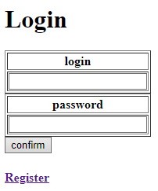
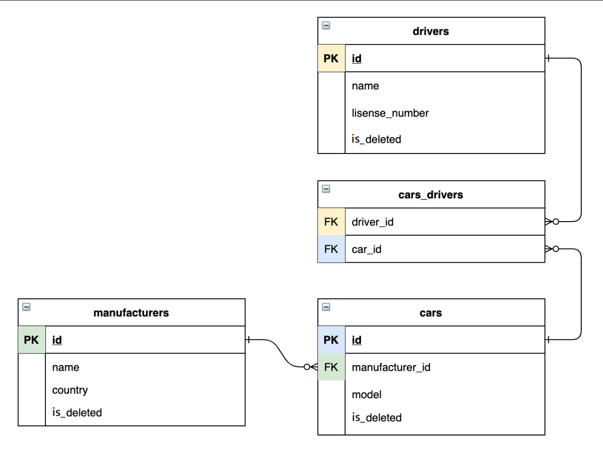

# 🚕TAXI-SERVICE

__Web application is written according to SOLID principles, client-server architecture__
___
## 🧰Functions:
* Registration new driver
* Authentication driver
* Create/Delete/Display cars
* Create/Delete/Display manufacturers
* Create/Delete/Display drivers
* Add driver to car
* Display drivers cars
* 
* 
___
## 🔧Structure
* Data Access Object layer uses CRUD methods with DB
* Services with logic
* Presentation level as JSP pages
___
## 📌Relations in db:

___
## 💻Technologies:
* JDK 11 or later
* Maven 4.0
* MySql 8.0.31
* Tomcat 9.0.50
* Javax servlet 4.0.1
* JSTL 1.2
___
## ⚙Installation
1. Copy data from [init_db.sql](src/main/resources/init_db.sql) into db
2. Configure [ConnectionUtil](src/main/java/taxi/util/ConnectionUtil.java) class with your parameters
3. Download tomcat 9.0.50
4. Edit configuration in your IDE
