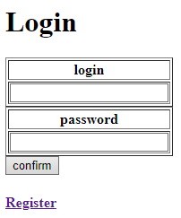
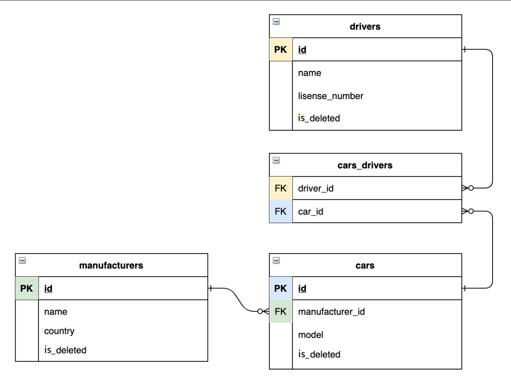

# 🚕TAXI-SERVICE

__Web application that use CRUD methods, SOLID principles, client-server architecture__
___
## 🧰Functions:
* registration
* authentication
* 
* Create/Delete/Display cars
* Create/Delete/Display manufacturers
* Create/Delete/Display drivers
* Add driver to car
* display drivers cars
* 
___
## 🔧structure
* Data Access Object layer CRUD operations with DB
* Services with logic
* Presentation level as JSP pages
___
## 📌Relations in db:

___
## 💻Technologies:
* JDK 11 or later
* Maven 4.0
* MySql 8.0.31
* Tomcat 9.0.50
* Javax servlet 4.0.1
* JSTL 1.2
___
## ⚙Installation
1. copy data from init_db.sql into db
2. configure ConnectionUtil class with your parameters
3. download tomcat 9.0.50
4. edit configuration in your IDE
